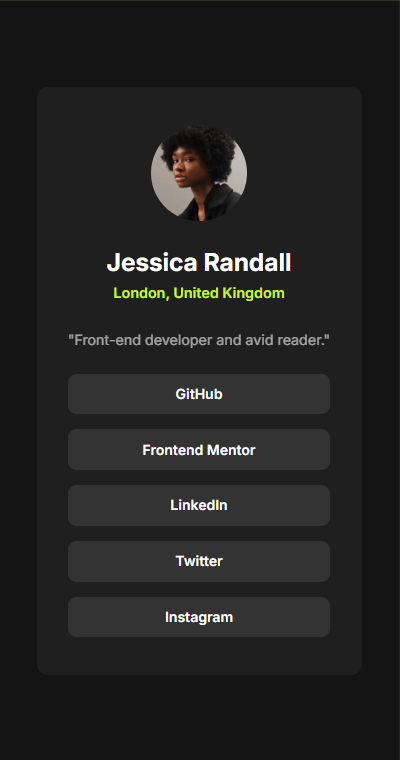
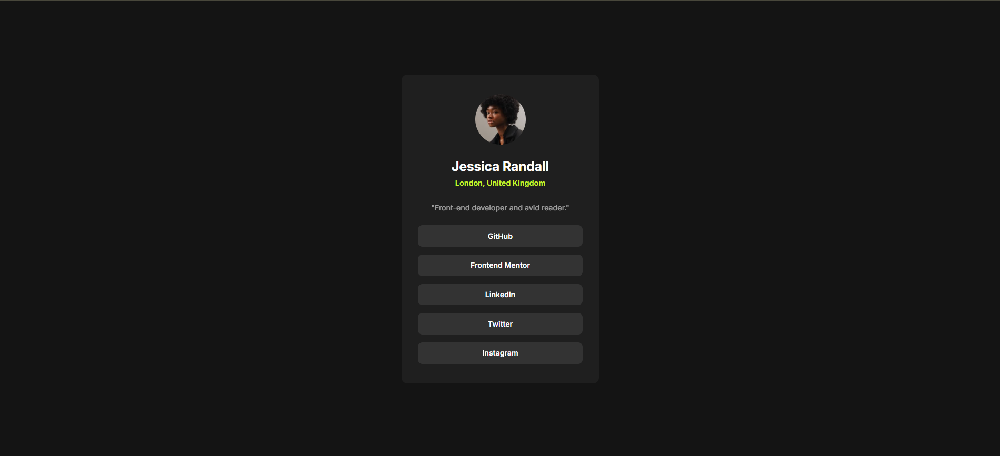

# Frontend Mentor - Social links profile solution

This is a solution to the [Social links profile challenge on Frontend Mentor](https://www.frontendmentor.io/challenges/social-links-profile-UG32l9m6dQ). Frontend Mentor challenges help you improve your coding skills by building realistic projects. 

## Table of contents

- [Overview](#overview)
  - [The challenge](#the-challenge)
  - [Screenshot](#screenshot)
  - [Links](#links)
- [My process](#my-process)
  - [Built with](#built-with)
  - [What I learned](#what-i-learned)
  - [Continued development](#continued-development)
  - [Useful resources](#useful-resources)
- [Author](#author)

## Overview

### The challenge

Users should be able to:

- See hover and focus states for all interactive elements on the page

### Screenshot

**Note** that the screenshots above do not match the live site because I personalised the information at the last moment. The avatar and name match my real life details.

### Links

- ✅ Solution URL: [Frontend Mentor solution](https://your-solution-url.com)
- 🌐 Live Site URL: [GitHub Pages]()

## My process

### Built with

- Semantic HTML5 markup
- CSS custom properties
- Flexbox

### What I learned

This mini project helped me understand that research and learning don't end no matter how much one may know. I had to revisit a few concepts and even learn new ones while I was taking this exercise. Semantic HTML5 markup is something I'm sure I'll be learning for quite a while.

### Continued development

Going forward, I intend to:
- continue practicing HTML5 semantic workflow
- work on improving my use of the mobile-first responsive method
- build confidence and creativity enough to write effective code

### Useful resources

- [W3Schools](https://www.w3schools.com/) - I find that I still have to carry out some research even while working on a project. I was unclear what semantic tags I needed to use to make my HTML5 workflow semantic. W3Schools helped me answer some of the questions I had. I really liked this pattern and will continue to use it going forward.

## Author

- 🌐 Website - [GitHub Pages]()
- Frontend Mentor - [@swaandaFJ](https://www.frontendmentor.io/profile/swaandaFJ)
- Twitter - [@swaan_dagwi](https://www.twitter.com/swaan_dagwi)
- Instagram - [@swaandagwi](https://www.instagram.com/swaandagwi)

---
*Swaandagwi Feng Jah*